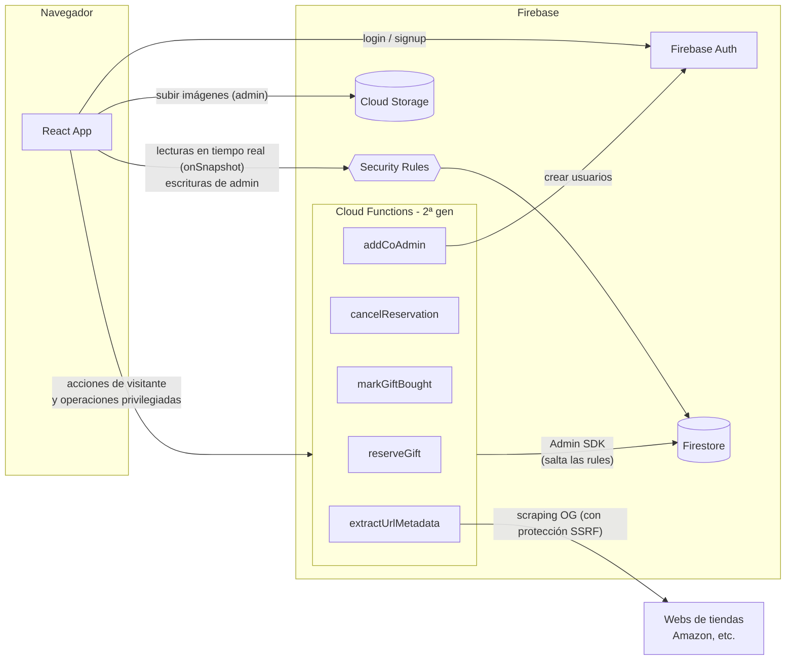

# 01 · Visión general

## ¿Qué es Regalitos?

Una app para crear y compartir **listas de regalos de bebé**:

- Los **padres (admins)** crean una lista con los regalos que quieren recibir.
- Comparten un enlace público (`https://<dominio>/<listId>`).
- Los **invitados (visitantes)** abren el enlace, ven los regalos y **reservan sin registrarse** — así se evita que dos personas compren lo mismo.
- El visitante que reservó puede marcar el regalo como comprado o cancelar su reserva.

## Los 3 roles

| Rol | Cómo se identifica | Qué puede hacer |
|---|---|---|
| **Admin** | Cuenta de Firebase Auth (email + contraseña) | Crear/editar/borrar regalos, editar la lista, añadir co-admins, reabrir regalos |
| **Co-admin** | Cuenta de Firebase Auth, su `uid` está en `adminIds` de la lista | Exactamente lo mismo que el admin |
| **Visitante** | **Anónimo**. Un token UUID generado en su navegador y guardado en `localStorage` | Ver la lista, reservar regalos, cancelar/completar **sus propias** reservas |

El punto clave del diseño: los visitantes **no tienen cuenta**. Su "identidad" es un token secreto que solo conoce su navegador. En el servidor solo se guarda un **hash** de ese token (ver [03 · Backend](03-backend-firebase.md#por-qué-el-token-se-guarda-hasheado)).

## Stack

| Capa | Tecnología |
|---|---|
| UI | React 18 + TypeScript + Vite |
| Estilos | Tailwind CSS 4 (+ `class-variance-authority`, `tailwind-merge`) |
| Formularios | react-hook-form + zod (validación) |
| Estado servidor | TanStack Query (react-query) + suscripciones `onSnapshot` de Firestore |
| Estado global cliente | Zustand (solo para la sesión de auth) |
| Routing | react-router-dom 6 |
| Backend | Firebase: Auth, Firestore, Storage, Cloud Functions (2ª gen, Node 22) |

## Primer de Firebase (si vienes de backends tradicionales)

En una app clásica tendrías un servidor (Express, Nest…) que hace de intermediario para todo. **En Firebase no hay un servidor tuyo corriendo siempre.** El "backend" está repartido en servicios gestionados por Google:

| Servicio | Qué es | En esta app |
|---|---|---|
| **Firestore** | Base de datos NoSQL de documentos, con tiempo real | Listas y regalos |
| **Firebase Auth** | Servicio de autenticación | Cuentas de admins/co-admins |
| **Cloud Storage** | Almacén de ficheros | Imágenes de los regalos |
| **Security Rules** | Autorización declarativa que se evalúa **en el servidor de Google** | Quién puede leer/escribir cada documento/fichero |
| **Cloud Functions** | Tu código Node ejecutado bajo demanda (serverless) | Reservas, co-admins, scraping de URLs |

La diferencia mental más importante:

> El cliente (navegador) habla **directamente** con Firestore/Auth/Storage la mayor parte del tiempo. No pasa por un servidor tuyo. Quien impide que un usuario haga lo que no debe son las **Security Rules**, no tu código.

## Arquitectura

Dos caminos hacia los datos:

1. **Camino directo** (la mayoría): el cliente lee/escribe Firestore y las Security Rules validan. Ejemplo: un admin crea un regalo; la regla comprueba que su `uid` está en `adminIds`.
2. **Camino por Functions** (operaciones sensibles): el cliente llama a una Cloud Function, que valida la lógica de negocio y escribe con el **Admin SDK** (que ignora las rules). Ejemplo: un visitante reserva un regalo.

## ¿Cuándo va algo por Functions y cuándo directo?

La pregunta a hacerse:

> ¿Puedo expresar esta autorización con `request.auth.uid` + datos que ya están en el documento, con una regla declarativa?

- **Sí** → cliente directo + Security Rules. Más rápido, más barato, y tiempo real gratis.
- **No** → Cloud Function. Casos en esta app:
  - **Secretos**: validar el token de reserva del visitante (se compara un hash en servidor; el token nunca puede ser público).
  - **Privilegios**: crear usuarios de Auth con el Admin SDK (`addCoAdmin`) — imposible de forma segura desde un navegador.
  - **Terceros**: descargar metadatos de una URL de tienda (`extractUrlMetadata`) — el navegador no puede por CORS y hay que protegerse de SSRF.
  - **Atomicidad sensible**: reservar solo si el regalo sigue `pending`, en transacción, sin que el cliente pueda manipular la condición.

Siguiente parada: [02 · Estructura del proyecto](02-estructura-proyecto.md).
