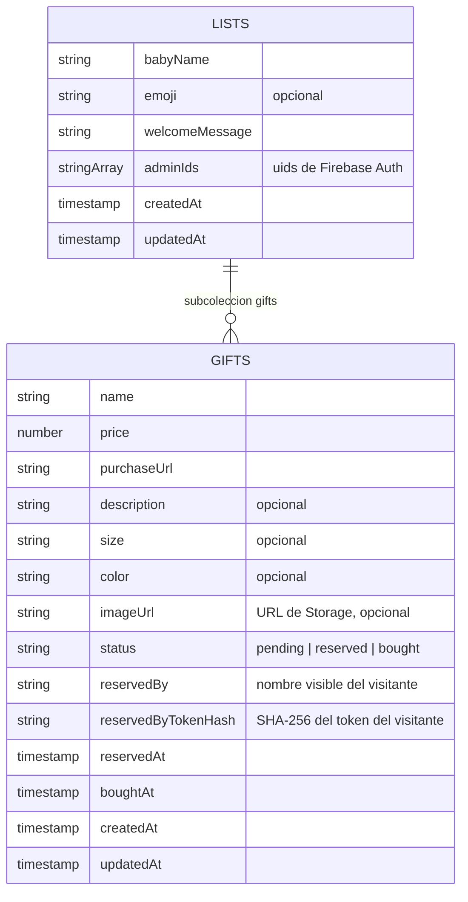
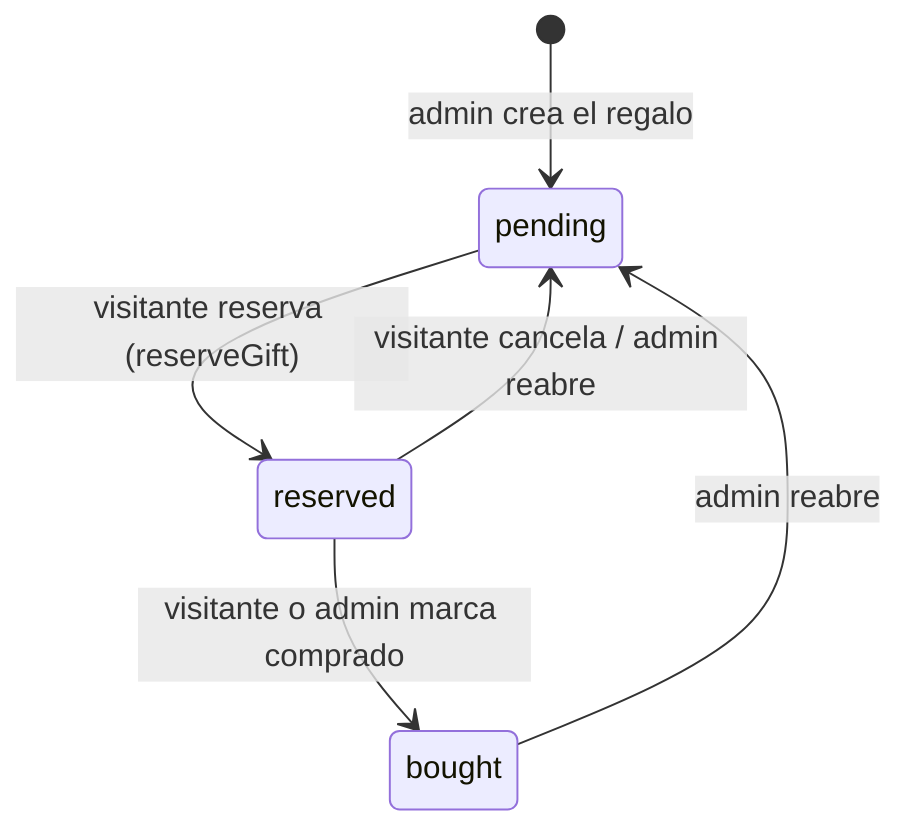

# 03 · Backend Firebase

## Modelo de datos (Firestore)

Firestore es una base de datos de **documentos** organizados en **colecciones**. Aquí solo hay una colección raíz con una subcolección:



- `lists/{listId}` — una lista por bebé. `adminIds` es la fuente de verdad de quién administra.
- `lists/{listId}/gifts/{giftId}` — los regalos. El ciclo de vida vive en `status`:



Las imágenes viven en **Storage** bajo `lists/{listId}/gifts/{giftId}/<uuid>.<ext>`; en Firestore solo se guarda la `imageUrl` de descarga.

## Cloud Functions

Código en `functions/src/`. Todas son **2ª gen** (`firebase-functions/v2`), región `us-central1`.

Dos tipos:

- **Callable** (`onCall`): se invocan desde el cliente con `httpsCallable(functions, 'nombre')`. El SDK gestiona serialización, y si hay sesión adjunta el auth automáticamente (`request.auth`).
- **HTTP** (`onRequest`): endpoint HTTP normal, se llama con `fetch`.

| Función | Tipo | Quién la llama | Qué valida / hace |
|---|---|---|---|
| `reserveGift` | callable | Visitante (anónimo) | **Transacción**: solo reserva si `status === 'pending'` (evita que dos visitantes ganen a la vez). Guarda `reservedByTokenHash` (SHA-256), nunca el token crudo |
| `cancelReservation` | callable | Visitante | Solo si `status === 'reserved'` **y** el hash del token enviado coincide con el guardado → solo quien reservó puede cancelar |
| `markGiftBought` | callable | Visitante | Igual que cancelar: propiedad verificada por hash |
| `addCoAdmin` | callable | Admin autenticado | Exige `request.auth` + que el caller esté en `adminIds`. Crea el usuario con el **Admin SDK** (o lo reutiliza si el email existe) y lo añade a `adminIds`. Al correr en servidor, **no toca la sesión** del navegador del caller |
| `extractUrlMetadata` | HTTP (`cors: true`) | Admin (form de añadir/editar regalo) | Descarga la URL de producto, extrae Open Graph (título, descripción, imagen en base64). Protegida contra **SSRF** |

Archivos: `functions/src/reservations.ts`, `functions/src/co-admins.ts`, `functions/src/url-metadata.ts`.

### Por qué el token se guarda hasheado

Los regalos son **legibles públicamente** (cualquiera con el enlace ve la lista). Si guardáramos el token de reserva en claro dentro del documento, cualquier visitante podría leer el token de otro y suplantarlo (cancelar reservas ajenas).

Solución:

1. El navegador del visitante genera un UUID y lo guarda en `localStorage` (nunca sale de ahí salvo hacia las callables).
2. Al reservar, la Cloud Function guarda `sha256(token)` en el documento.
3. Para pintar "esta reserva es mía", el cliente calcula `sha256(miToken)` con **Web Crypto** y lo compara con `reservedByTokenHash`.
4. Para cancelar/comprar, envía el token crudo a la callable, que hashea y compara **en servidor**.

El hash es idéntico en ambos lados: `crypto.createHash('sha256')` en Node (`functions/src/utils/token.ts`) y `crypto.subtle.digest('SHA-256')` en el navegador (`src/features/reservations/hooks/use-visitor.ts`) producen el mismo hex.

### Protección SSRF en extractUrlMetadata

`extractUrlMetadata` hace `fetch` de una URL que envía el usuario — el ataque clásico es pedirle URLs internas (`http://169.254.169.254/`, `localhost`...) para usar tu servidor como proxy. Defensa en `functions/src/utils/safe-fetch.ts`:

- Solo `http:`/`https:`.
- Resuelve el DNS del host y **rechaza si alguna IP no es pública** (clasificación con `ipaddr.js`: loopback, rangos privados, link-local, CGNAT, etc.).
- Sigue los redirects **manualmente**, revalidando cada salto (un 302 hacia una IP interna también se bloquea).
- La descarga de la imagen pasa por el mismo filtro y exige `content-type: image/*`.

## Security Rules

Las rules son la **única barrera** entre el navegador y tus datos en los accesos directos. Se despliegan aparte del código.

### `firestore.rules`

```
function isListAdmin(listId) {
  return request.auth != null && request.auth.uid in getList(listId).adminIds;
}

match /lists/{listId} {
  allow read: if true;                          // cualquiera puede ver una lista
  allow create: if request.auth != null;        // cualquier usuario logueado crea listas
  allow update, delete: if isListAdmin(listId); // solo sus admins la modifican
}

match /lists/{listId}/gifts/{giftId} {
  allow read: if true;                          // los regalos son públicos
  allow create, delete: if isListAdmin(listId);
  allow update: if isListAdmin(listId);         // SOLO admins escriben directo
}
```

Fíjate: **los visitantes no tienen permiso de escritura en ningún sitio**. Sus acciones (reservar/cancelar/comprar) van por Cloud Functions, que usan el Admin SDK — y el Admin SDK **ignora las rules** (por eso la validación de negocio vive dentro de la función).

### `storage.rules`

```
match /lists/{listId}/gifts/{giftId}/{allPaths=**} {
  allow read: if true;                          // imágenes públicas
  allow create, update: if isListAdmin(listId)
    && request.resource.size < 5 * 1024 * 1024  // máx 5 MB
    && request.resource.contentType.matches('image/.*');
  allow delete: if isListAdmin(listId);
}

match /{allPaths=**} { allow read, write: if false; }  // todo lo demás: denegado
```

Nota: las rules de Storage pueden **leer Firestore** (`firestore.get(...)`) para consultar `adminIds` — así ambas capas comparten la misma fuente de verdad.

## Deploy

```bash
# Compilar y desplegar functions + rules
cd functions && npm run build && cd ..
firebase deploy --only firestore:rules,functions
```

Cosas que debes saber antes de desplegar:

1. **Orden seguro cuando haya usuarios en producción**: primero functions (aditivo), luego el frontend nuevo, y las rules al final. Si endureces rules antes de actualizar el frontend, el frontend viejo puede quedarse sin permisos.
2. **1ª gen ↔ 2ª gen no es in-place**: Firebase no permite convertir una función existente de generación. Hay que borrarla (`firebase functions:delete <nombre>`) y redesplegar. Ya se hizo la migración a 2ª gen; solo te afectará si creas funciones nuevas copiando código antiguo de 1ª gen.
3. El frontend (`dist/`) **no** se despliega con Firebase CLI (no hay `hosting` en `firebase.json`).
4. Proyecto activo: `lista-bebes` (ver `.firebaserc`). Consola: https://console.firebase.google.com/project/lista-bebes
