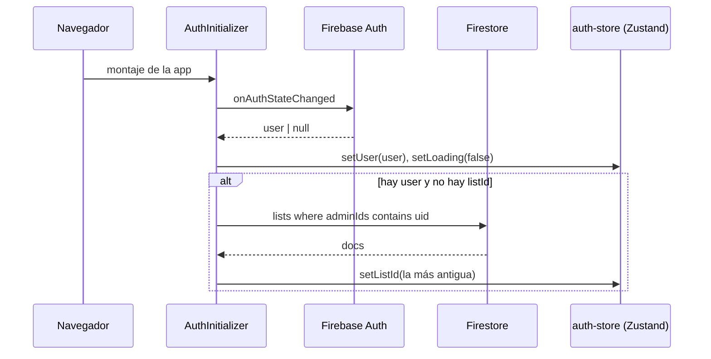
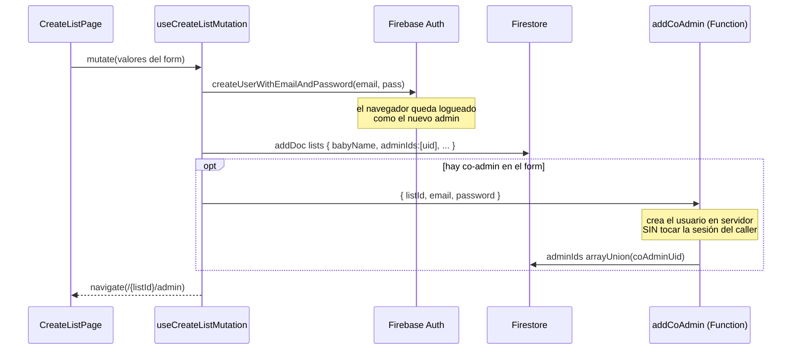
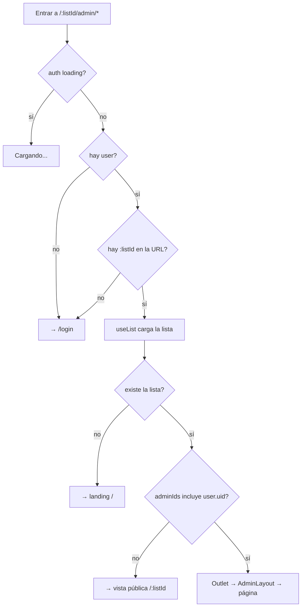
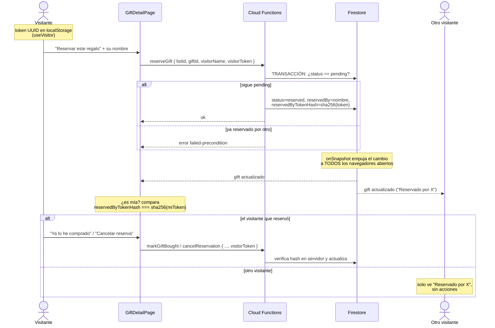

# 04 · Flujos end-to-end

Este doc explica cómo se conectan las piezas en cada flujo real de la app. Los archivos citados son clicables desde el repo.

## 1. Arranque de la app y sesión

Cadena de arranque: `src/main.tsx` → `src/App.tsx` → `src/app/providers.tsx` (QueryClientProvider + `AuthInitializer`) → `RouterProvider`.

`AuthInitializer` (`src/features/auth/hooks/auth-initializer.tsx`) es un componente sin UI que hace dos cosas:

1. **Observa la sesión**: `useAuthObserver` se suscribe a `onAuthStateChanged` de Firebase Auth y vuelca el usuario en el store de Zustand (`src/features/auth/store/auth-store.ts`). Mientras Firebase decide si hay sesión persistida, `loading = true` (por eso las guardas muestran "Cargando...").
2. **Resuelve la lista del admin**: si hay usuario pero no `listId`, consulta `getListsByAdminId(uid)` y elige la lista **más antigua** por `createdAt` (determinista; hoy la app asume una lista "principal" por usuario).



El store de auth es la **única fuente de verdad de sesión** en el cliente: cualquier componente lee `useAuthStore((s) => s.user / s.listId / s.loading)`.

## 2. Crear una lista (`/crear`)

Página: `src/app/pages/public/create-list-page.tsx`. Un solo formulario crea la lista **y** la cuenta del admin (y opcionalmente el co-admin).

- Validación con zod: `createListSchema` en `src/features/lists/schemas/list-schemas.ts` (exige contraseña de co-admin si diste su email).
- `useAutofillSync` (`src/app/shared/hooks/use-autofill-sync.ts`): workaround para que el autofill de Chrome sincronice los valores al estado de react-hook-form.
- Si ya tienes `listId` en el store, la página redirige a tu configuración.

La mutación `useCreateListMutation` (`src/features/lists/hooks/use-create-list.ts`):



> ¿Por qué el co-admin va por Cloud Function? Porque `createUserWithEmailAndPassword` **en el cliente** cambia la sesión activa al usuario recién creado — crearlo en servidor evita ese secuestro de sesión. Detalle en [features/sharing](features/sharing.md).

## 3. Login (`/login`)

`useLoginMutation` (`src/features/auth/hooks/use-login.ts`): `signInWithEmailAndPassword` → guarda el user en el store → busca sus listas → si no tiene ninguna lanza error ("No tienes ninguna lista asociada"); si tiene, guarda el `listId` y navega a `/{listId}/admin`.

## 4. Guardas de ruta

`AuthGuard` (`src/app/shared/layouts/auth-guard.tsx`) envuelve todas las rutas `/:listId/admin/*`. Orden de decisiones:



Importante: esto es UX, **no** seguridad. La seguridad real la dan las Security Rules y las validaciones de las Cloud Functions ([03 · Backend](03-backend-firebase.md#security-rules)) — aunque alguien saltase la guarda, no podría escribir nada.

## 5. Añadir / editar un regalo (admin)

Páginas: `src/features/gifts/pages/admin-add-gift-page.tsx` y `admin-edit-gift-page.tsx`.

El flujo estrella del formulario es el **autorrellenado desde una URL de tienda**:

```mermaid
sequenceDiagram
    participant A as Admin (form)
    participant EM as extractUrlMetadata (Function)
    participant T as Tienda (Amazon, etc.)
    participant FS as Firestore
    participant ST as Storage

    A->>EM: POST { url: purchaseUrl }
    EM->>T: fetch con protección SSRF
    T-->>EM: HTML
    EM-->>A: { title, description, imageDataUrl }
    Note over A: el form se autorrellena;<br/>la imagen llega en base64 y se convierte a File

    A->>FS: createGift → addDoc (status: pending)
    Note over FS: las rules permiten porque<br/>el uid está en adminIds
    A->>ST: uploadGiftImage(listId, giftId, file)
    Note over ST: nombre aleatorio uuid.ext
    ST-->>A: downloadURL
    A->>FS: updateGift { imageUrl }
```

Hooks implicados: `useCreateGift`, `useUpdateGift`, `useDeleteGift` (`src/features/gifts/hooks/`). Servicios: `src/features/gifts/api/gifts/service.ts` (Firestore directo) y `image-service.ts` (Storage).

## 6. Ciclo de vida de una reserva (visitante) — el corazón de la app

El visitante es anónimo. Su identidad es un **token UUID** que `useVisitor` (`src/features/reservations/hooks/use-visitor.ts`) genera y guarda en `localStorage` la primera vez. El hook también expone `visitorTokenHash` (SHA-256 calculado con Web Crypto) para comparar con lo que hay en Firestore.



Puntos clave:

- **El token crudo nunca se guarda en Firestore** (las lecturas son públicas). Solo el hash. Ver [03 · Backend](03-backend-firebase.md#por-qué-el-token-se-guarda-hasheado).
- **La transacción** en `reserveGift` es lo que impide que dos visitantes reserven a la vez el mismo regalo.
- **Acciones de admin en paralelo**: desde el panel, un admin puede *reabrir* un regalo o *marcarlo comprado* sin token. Eso NO va por callables: escribe directo a Firestore vía `src/features/reservations/api/reservations/admin-service.ts` (las rules lo permiten por ser admin). Fíjate en la separación de hooks: `useMarkBought` (visitante, callable) vs `useAdminMarkBought` (admin, directo).
- Si un admin reabre un regalo, el hash se borra y vuelve a `pending` para todos.

## 7. Tiempo real: onSnapshot vs TanStack Query

Dos mecanismos conviven para el estado de servidor; conviene saber cuál se usa dónde y por qué:

| Mecanismo | Dónde | Por qué |
|---|---|---|
| **onSnapshot** (suscripción Firestore) | `useGifts` (colección de regalos), `useGift` (un regalo) — `src/features/gifts/hooks/` | Los regalos cambian por acciones de OTROS (un visitante reserva, el admin edita). La suscripción empuja el cambio a todos los navegadores sin refetch. Por eso las mutaciones de reservas **no necesitan invalidar nada**: el snapshot llega solo |
| **TanStack Query** | `useList` (datos de la lista) y todas las **mutaciones** | La lista cambia poco; con `staleTime` 30s y una invalidación puntual (p. ej. al añadir co-admin) basta. Las mutaciones ganan estados `isPending`/`isError` gratis |

Regla práctica al añadir features: si el dato puede cambiar "debajo de ti" por otra persona → `onSnapshot`; si solo cambia por acciones del propio usuario → query + invalidación.

## 8. Compartir y co-admins

- **Compartir**: `ShareButton` (`src/features/sharing/components/share-button.tsx`) copia `origin/{listId}` al portapapeles.
- **Co-admins**: desde configuración, `AddCoAdminDialog` → `useAddCoAdmin` → callable `addCoAdmin` (`functions/src/co-admins.ts`). La función exige que el caller esté autenticado y sea admin de esa lista; crea (o reutiliza) la cuenta y añade su uid a `adminIds`. `CoAdminBanner` avisa en la vista pública cuando la lista tiene más de un admin.

---

Siguiente: los detalles de cada feature en [`docs/features/`](features/).
