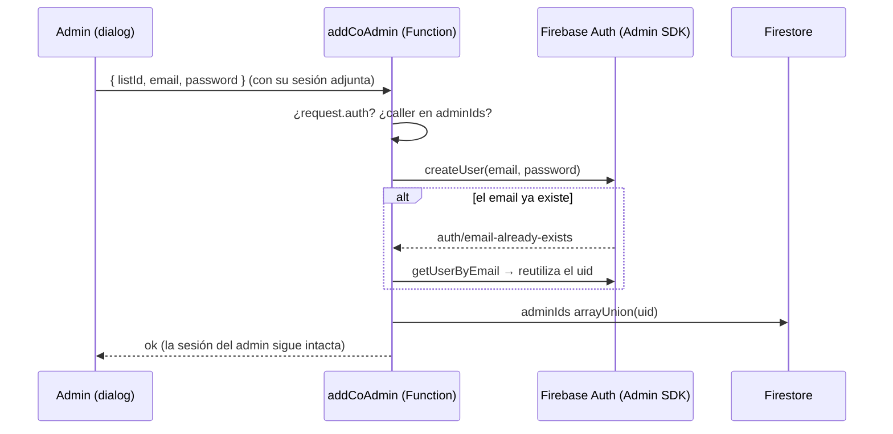

# Feature: sharing

Dos cosas: **compartir la lista** (copiar el enlace público) y **gestionar co-admins** (dar acceso de administración a otra persona, típicamente la pareja).

## Archivos

```
src/features/sharing/
├── api/
│   ├── index.ts
│   └── sharing/
│       └── service.ts          # getPublicListUrl, copyShareUrl, addCoAdmin (callable)
├── components/
│   ├── share-button.tsx        # Botón "Compartir" → copia URL, feedback "Enlace copiado"
│   ├── co-admin-banner.tsx     # Banner en la vista pública si hay >1 admin
│   └── add-co-admin-dialog.tsx # Dialog (headlessui) con form email+contraseña
└── hooks/
    └── use-add-co-admin.ts     # useAddCoAdmin → callable + invalida ['list', listId]
```

Backend: `functions/src/co-admins.ts` (callable `addCoAdmin`).

## Compartir

- `getPublicListUrl(listId)` → `${window.location.origin}/${listId}`.
- `copyShareUrl` la copia al portapapeles (`navigator.clipboard`).
- `ShareButton` muestra "Enlace copiado" durante 2,5 s.

No hay más: el enlace funciona porque las listas y regalos son públicos de lectura por rules.

## Co-admins: por qué va por Cloud Function

El modelo es simple: **ser co-admin = tu uid está en `adminIds` de la lista**. No hay roles diferenciados; un co-admin puede todo lo que el creador.

Lo delicado es **crear la cuenta** del co-admin. Si se hiciera en el cliente con `createUserWithEmailAndPassword`, Firebase **cambiaría la sesión activa** del navegador al usuario recién creado — el admin quedaría deslogueado y logueado como su pareja. Por eso existe la callable `addCoAdmin`:



Validaciones de la función: caller autenticado, caller admin de esa lista, contraseña ≥ 6 caracteres, lista existente. Si el usuario ya era admin devuelve `alreadyAdmin: true` sin duplicar.

`useAddCoAdmin` invalida la query `['list', listId]` al terminar para refrescar el contador de admins.

## Puntos de entrada en la UI

- **AdminSettingsPage** — `ShareButton` + `AddCoAdminDialog`.
- **CreateListPage** — el alta de lista permite co-admin opcional; internamente usa la misma callable (ver [04 · Flujos §2](../04-flujos.md#2-crear-una-lista-crear)).
- **PublicListPage** — `CoAdminBanner` informativo.

## Flujos donde participa

- [Compartir y co-admins](../04-flujos.md#8-compartir-y-co-admins)
- [Crear lista](../04-flujos.md#2-crear-una-lista-crear)
